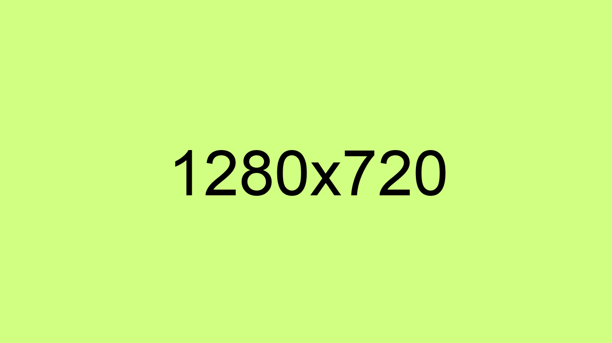

<hr>

<div align="center">
  <p></p>
  <sub>SCRIPTING</sub>
  <h1>MUGCRAFT</h1>
</div>

<p align="center">Lorem ipsum dolor sit amet, consectetur adipiscing elit. Duis ac purus vel mauris volutpat efficitur eget a lectus. Maecenas facilisis sed augue in faucibus. Vestibulum viverra porta enim malesuada ullamcorper, integer nec libero aliquet.</p>

<hr>

### Update Everything

<p></p>

Lorem ipsum dolor sit amet, consectetur adipiscing elit. Aenean scelerisque, turpis quis congue pellentesque, turpis metus mattis purus, id eleifend ligula libero ac mauris.

<hr>

### Getting Started

Blindly executing this is strongly discouraged.

```powershell
$Address = "https://raw.githubusercontent.com/olankens/mugcraft/HEAD/src/Mugcraft.ps1"
$Fetched = New-Item $Env:Temp\Mugcraft.ps1 -F ; Invoke-WebRequest $Address -OutFile $Fetched
Try { Pwsh -Ep Bypass $Fetched } Catch { Powershell -Ep Bypass $Fetched }
```

<hr>